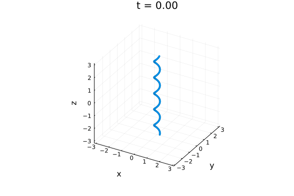

## Single helix

*Initialises a single, helix of amplitude ``A`` and wavenumber ``k``.*



### Usage
```julia
struct SingleHelix{A} <: InitCond
    A_KW::A #Amplitude of the Kelvin wave
    b_KW::A #Wavenumber of the Kelvin wave
    box_length_z::A #Length in vertical z-direction
end
```

Helical vortex oriented in the ``z`` direction, of size `box_length_z`, taken to be the size of the box in ``z``.

Parameters are as follows:

`A_KW` is the amplitude scaled by `2π`, ``A_{KW} = A/2π``

`b_KW` is the wavelength ``λ`` scaled by ``2π``, ``b_kw = λ/2π = 1/k``

Example:
```julia
#Set a helix of 
IC = SingleHelix(0.2, 0.1, 2π)
```
